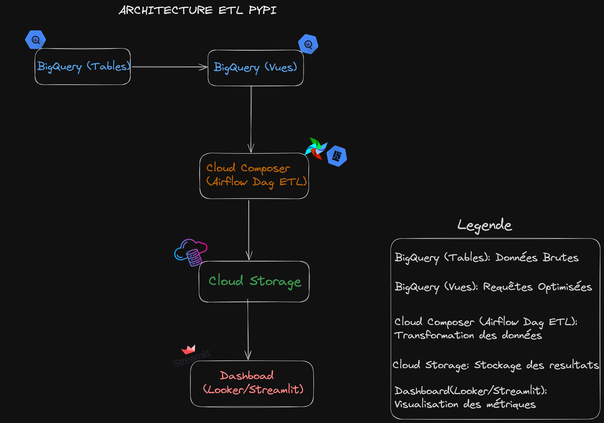

# Pipeline de Monitoring des Téléchargements PyPi

## Présentation

Ce projet met en place un pipeline ETL pour monitorer les téléchargements PyPi sur BigQuery. Il comprend :
- **Extraction** des données depuis `bigquery-public-data.pypi.file_downloads`
- **Transformation** des données (formatage, ajout de métriques comme `is_gzipped`)
- **Chargement** des données sur **Google Cloud Storage (GCS)**
- **Orchestration** du pipeline avec **Airflow (Cloud Composer)**
- **Visualisation** avec **Looker Studio et Streamlit**
- **Création de vues BigQuery** pour des analyses optimisées

## **Architecture du projet**

Voici un aperçu de l'architecture du pipeline ETL : Le pipeline suit une architecture en plusieurs étapes allant de l’extraction des données brutes jusqu'à leur visualisation dans des dashboards interactifs.



## **Installation et Configuration**
### 1 - **Prérequis**
Assurez-vous d'avoir :
- **Python 3.11+** et `pip` installés
- **Google Cloud SDK** (`gcloud`) configuré avec un projet actif
- **BigQuery API, Cloud Storage API et Cloud Composer activés**
- **Un bucket GCS** pour stocker les fichiers transformés
- **Un environnement Cloud Composer (Airflow)** configuré

### **2 - Cloner le projet et installer les dépendances**
```bash
git clone https://github.com/votre-repo/pypi_project.git
cd pypi_project
pip install -r requirements.txt
```
### **3 - Déploiement**
#### Déploiement du DAG Airflow
- Placez le fichier `dag_pypi.py` dans le répertoire `dags/` du bucket Cloud Composer.
- Synchronisez les fichiers avec :
  ```bash
  gcloud storage cp dags/dag_pypi.py gs://<YOUR_COMPOSER_BUCKET>/dags/
  ```

### **4 - Exécution du pipeline en local**
  ```bash
  python src/main.py
  ```

### **5 - Utilisation des Vues BigQuery**
Ce projet utilise les tables brutes **BigQuery Public Datasets**, mais pour améliorer les performances, des **vues BigQuery** sont disponibles.

**- Pourquoi utiliser les vues BigQuery ?**

- **Moins de volume de données extraites** → Réduction des coûts et des temps d’exécution.
- **Données déjà filtrées et pré-transformées** → Moins de transformations dans le pipeline.
- **Plus rapide pour l'analyse et le dashboard**.

**- Vues disponibles :**
| Nom de la vue | Description |
| ------ | ------ |
| `pypi_views.50_downloads` | Contient uniquement les téléchargements des 15 derniers jours|
| `pypi_views.file_downloads_extended`   | Ajoute la durée entre téléchargements et l’indicateur `is_gzipped`|
| `pypi_views.gzipped_files` | Filtre uniquement les fichiers compressés (`.gz`)|


**- Comment utiliser une vue dans le pipeline ?**
Si vous souhaitez utiliser une **vue BigQuery** au lieu des tables brutes, modifiez `extract.py` en remplaçant la requête SQL par :
```python
query = "SELECT * FROM `western-watch-418016.pypi_views.fifth_downloads`"
```

### **6 - Accès aux résultats**
- Les fichiers transformés sont disponibles sur **Cloud Storage** (gs://<YOUR_BUCKET_NAME>/data/)
- Les vues sont accessibles sur BigQuery (western-watch-418016.pypi_views).
- Les dashboards sont accessibles sur Looker Studio ou Streamlit.

### **7 - Visualisation des Dashboards**

Les dashboards sont accessibles via **Looker Studio** (via BigQuery) ou en local avec **Streamlit**.

** - Exécution du dashboard avec Streamlit**
Si vous souhaitez visualiser les données en local, exécutez :

```bash
streamlit run src/dashboard.py
```
- Prérequis : Assurez-vous d’avoir Streamlit installé dans votre environnement
```bash
pip install streamlit
```

### **8 Contact**
Si vous avez des questions, vous pouvez me contacter :
- 📧 Email : barrydjoulde15@gmail.com
- 🔗 LinkedIn : https://www.linkedin.com/in/djould%C3%A9-barry-24868a187
- 📝 Issues : Ouvrez une issue sur [le repo GitLab](https://gitlab.com/barrydjoulde/pypi-monitoring-pipeline)


